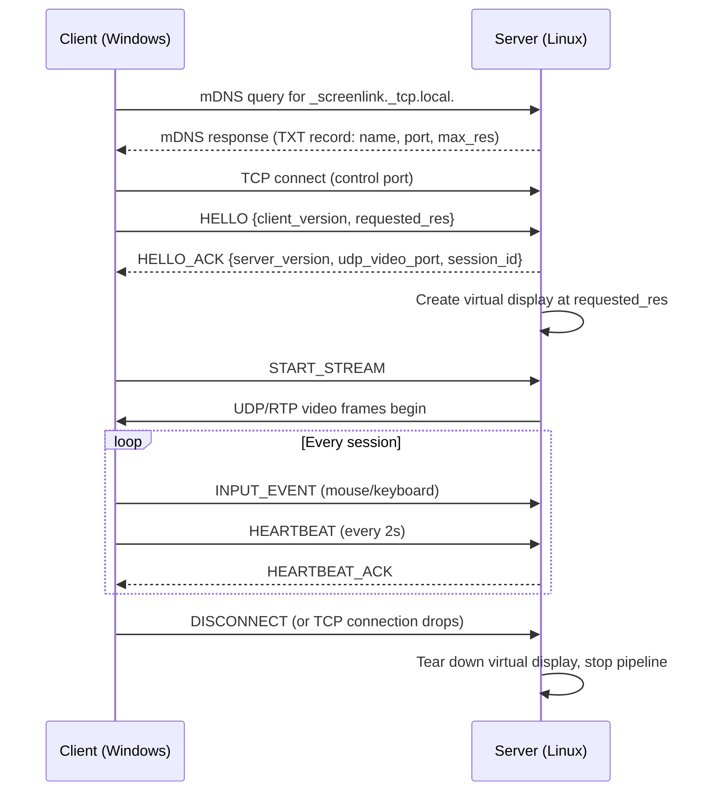

# Architecture

This document specifies the system design for ScreenLink: component responsibilities, network protocols, packetization, and the reasoning behind each decision. It's written to be detailed enough to implement against directly.

## Table of Contents
1. [Goals & Non-Goals](#1-goals--non-goals)
2. [High-Level System Diagram](#2-high-level-system-diagram)
3. [Component Breakdown](#3-component-breakdown)
4. [Discovery Protocol](#4-discovery-protocol)
5. [Connection Lifecycle](#5-connection-lifecycle)
6. [Control Channel Protocol Spec](#6-control-channel-protocol-spec)
7. [Video Channel Protocol Spec](#7-video-channel-protocol-spec)
8. [Input Event Protocol](#8-input-event-protocol)
9. [Virtual Display Creation on Linux](#9-virtual-display-creation-on-linux)
10. [Screen Capture & Encode Pipeline (Server)](#10-screen-capture--encode-pipeline-server)
11. [Decode & Render Pipeline (Client)](#11-decode--render-pipeline-client)
12. [Input Capture & Injection](#12-input-capture--injection)
13. [Latency Budget](#13-latency-budget)
14. [Security Model](#14-security-model)
15. [Failure Modes & Reconnection](#15-failure-modes--reconnection)

---

## 1. Goals & Non-Goals

**Goals**
- Sub-100ms glass-to-glass latency on a typical home 5GHz Wi-Fi network at 1080p.
- Zero-configuration connection between a Linux host and a Windows client on the same LAN.
- Genuine display extension (an addressable second desktop), not just screen mirroring.
- A protocol simple enough to reimplement in another language later (deliberately plain JSON + standard RTP, no custom binary framing).

**Non-Goals (for v1)**
- Internet/WAN streaming through NAT — LAN only. Relaying over the internet introduces a completely different latency, security, and NAT-traversal problem (see Spacedesk's own architecture, which is LAN-first) and is explicitly out of scope until the LAN case is solid.
- Audio passthrough — deferred to keep the v1 pipeline and bandwidth budget simple.
- Wayland virtual-display creation — see §9; Wayland is supported for *capture* but not yet for *virtual output creation*.

## 2. High-Level System Diagram

```mermaid
flowchart LR
    subgraph Linux["Linux Desktop (Server)"]
        VD[Virtual Display<br/>xrandr dummy output]
        CAP[Screen Capturer<br/>ximagesrc / pipewiresrc]
        ENC[H.264 Encoder<br/>vaapih264enc / x264enc]
        RTPTX[RTP Payloader + UDP Sink]
        UINPUT[uinput virtual<br/>mouse & keyboard]
        CTRLSRV[Control Server<br/>TCP + JSON]
        DISC[mDNS Responder]
        VD --> CAP --> ENC --> RTPTX
        CTRLSRV --> UINPUT
    end

    subgraph Windows["Windows Laptop (Client)"]
        DISCC[mDNS Browser]
        CTRLCLI[Control Client<br/>TCP + JSON]
        RTPRX[UDP Src + RTP Depayloader]
        DEC[H.264 Decoder<br/>d3d11/hw or sw]
        REND[Full-screen Renderer]
        HOOK[Mouse/Keyboard Hooks]
        RTPRX --> DEC --> REND
        HOOK --> CTRLCLI
    end

    DISC <-.mDNS.-> DISCC
    CTRLSRV <==TCP: control + input==> CTRLCLI
    RTPTX ==UDP/RTP: video==> RTPRX
```

## 3. Component Breakdown

### Server (Linux)

| Component | Responsibility |
|---|---|
| **Display Manager** | Creates and tears down the virtual X11 output (§9). |
| **Screen Capturer** | Grabs frames from the virtual display via GStreamer source elements. |
| **Encoder** | Compresses frames to H.264, hardware-accelerated when a supported GPU is present. |
| **RTP Sender** | Packetizes encoded frames into RTP and writes them to a UDP socket. |
| **Control Server** | Accepts the client's TCP connection; handles handshake, capability negotiation, heartbeats, and incoming input events. |
| **Input Injector** | Translates incoming input JSON messages into `uinput` kernel events. |
| **Discovery Responder** | Advertises itself over mDNS as `_screenlink._tcp.local.`. |

### Client (Windows)

| Component | Responsibility |
|---|---|
| **Discovery Browser** | Listens for `_screenlink._tcp.local.` services on the LAN and lists them in the UI. |
| **Control Client** | Opens the TCP control connection, performs handshake, sends periodic heartbeats and all input events. |
| **RTP Receiver** | Reads UDP packets, reorders/depayloads them into an H.264 stream via a GStreamer jitter buffer. |
| **Decoder** | Decodes H.264, hardware-accelerated via Media Foundation/D3D11 where available. |
| **Renderer** | Displays the decoded video full-screen (borderless window pinned to the laptop's panel). |
| **Input Hooks** | Global low-level mouse/keyboard hooks, translated into protocol messages. |

## 4. Discovery Protocol

ScreenLink uses **mDNS/DNS-SD** (the same mechanism as AirPlay/Chromecast) rather than a custom UDP broadcast protocol, because:
- It's a well-understood, already-debugged standard with mature libraries on both platforms (`python-zeroconf` on Linux/Python, `zeroconf`/Bonjour on Windows).
- It works across most consumer routers without extra configuration (unlike raw UDP broadcast, which some routers restrict).

**Service type:** `_screenlink._tcp.local.`
**TXT record fields:**

| Key | Example | Meaning |
|---|---|---|
| `version` | `1` | Protocol version, for compatibility checks. |
| `name` | `bharat-desktop` | Human-readable host name shown in the client UI. |
| `port` | `48321` | TCP control port (video UDP port is negotiated during handshake, see §5). |
| `max_res` | `1920x1080` | Maximum resolution the server's virtual display supports. |

## 5. Connection Lifecycle



## 6. Control Channel Protocol Spec

**Transport:** TCP, one persistent connection per session.
**Framing:** newline-delimited JSON (each message is a single JSON object followed by `\n`) — chosen over length-prefixed binary framing because it's trivially debuggable with `nc`/Wireshark and the control channel's throughput requirements are negligible (a handful of messages per second).

**Message envelope:**
```json
{"type": "<MESSAGE_TYPE>", "seq": 42, "payload": { ... }}
```

| `type` | Direction | Payload | Purpose |
|---|---|---|---|
| `HELLO` | C→S | `{client_version, requested_res, requested_fps}` | Opens the session, states client capabilities. |
| `HELLO_ACK` | S→C | `{server_version, udp_video_port, session_id, granted_res, granted_fps}` | Confirms session parameters; resolution may be downgraded if unsupported. |
| `START_STREAM` | C→S | `{}` | Client signals it's ready to receive video. |
| `STOP_STREAM` | C→S | `{}` | Pauses the video pipeline without closing the session (e.g., laptop lid closed). |
| `INPUT_EVENT` | C→S | see §8 | Mouse/keyboard event. |
| `RESOLUTION_CHANGE` | C→S | `{width, height}` | Requests a live resolution change. |
| `HEARTBEAT` / `HEARTBEAT_ACK` | both | `{ts}` | Liveness check every 2s; 3 missed beats triggers reconnection logic (§15). |
| `DISCONNECT` | either | `{reason}` | Graceful session teardown. |

## 7. Video Channel Protocol Spec

**Transport:** UDP, one unidirectional stream, server → client.
**Packetization:** standard **RTP** (RFC 3550) with the **H.264 payload format** (RFC 6184), produced by GStreamer's `rtph264pay`/consumed by `rtph264depay` — this is deliberately *not* a custom packetization scheme.

Why RTP over a hand-rolled protocol:
- H.264 NAL units routinely exceed the ~1400-byte practical UDP MTU; RTP's H.264 payload format already defines standard fragmentation (FU-A units) and reassembly, which GStreamer implements and battle-tests for us.
- RTP sequence numbers and timestamps give the client jitter buffer (`rtpjitterbuffer` element) everything it needs to reorder and pace frames without custom code.
- Off-the-shelf tools (Wireshark, `gst-launch`) can inspect and debug the stream directly.

**Pipeline-level packetization summary:**
```
Raw frame → H.264 encoder → NAL units → rtph264pay (fragments into RTP/UDP packets, ≤1400 bytes payload) → UDP socket → network
```

**Loss handling:** UDP is lossy by design here — a dropped packet becomes a dropped/corrupted frame, not a stall. The encoder is configured with a short GOP (group-of-pictures) and periodic forced keyframes so the decoder self-heals within a few frames rather than freezing.

## 8. Input Event Protocol

Input events ride the **control (TCP) channel**, not the video (UDP) channel — see the rationale in [README.md](README.md#technology-stack). Payload shapes:

```json
// Mouse move (absolute, normalized 0.0–1.0 so it's resolution-independent)
{"type": "INPUT_EVENT", "payload": {"kind": "mouse_move", "x": 0.4231, "y": 0.887}}

// Mouse button
{"type": "INPUT_EVENT", "payload": {"kind": "mouse_button", "button": "left", "action": "down"}}

// Scroll
{"type": "INPUT_EVENT", "payload": {"kind": "scroll", "delta_x": 0, "delta_y": -120}}

// Keyboard (uses evdev keycode names for unambiguous cross-platform mapping)
{"type": "INPUT_EVENT", "payload": {"kind": "key", "code": "KEY_LEFTSHIFT", "action": "down"}}
```

Normalized coordinates (rather than raw pixel coordinates) mean the protocol doesn't break if the negotiated resolution changes mid-session.

## 9. Virtual Display Creation on Linux

This is the trickiest platform-specific piece, and the design deliberately scopes it per display server:

**X11 (v1, primary supported path):**
Use the `dummy` X driver (`xf86-video-dummy`) or, more portably, `xrandr`'s ability to add a virtual output mode without a physical monitor attached:
```bash
xrandr --newmode "1920x1080_60" <modeline>
xrandr --addmode VIRTUAL1 "1920x1080_60"
xrandr --output VIRTUAL1 --mode "1920x1080_60" --right-of eDP-1
```
The server then captures **only that output** via GStreamer's `ximagesrc` with `xid`/`startx`,`starty`,`endx`,`endy` set to the virtual output's geometry — not the whole desktop.

**Wayland (roadmap, not v1):**
Wayland has no direct equivalent to `xrandr --newmode` for compositors in general; virtual-output support is compositor-specific (e.g., wlroots-based compositors expose it via `wlr-output-management`, GNOME/Mutter does not, as of this writing). Screen *capture* on Wayland is handled separately via the `xdg-desktop-portal` + PipeWire (`pipewiresrc` in GStreamer), which works today for mirroring an *existing* output, but creating a new virtual one is compositor-dependent. **v1 targets X11 and XWayland-compatible setups only**; native Wayland virtual-output creation is tracked as a roadmap item once a compositor-agnostic approach is validated.

## 10. Screen Capture & Encode Pipeline (Server)

Conceptual GStreamer pipeline (the real implementation builds this via `Gst.parse_launch` or the Python element API, not necessarily the CLI form shown):

```
ximagesrc use-damage=0 startx=1920 starty=0 endx=3839 endy=1079 !
video/x-raw,framerate=60/1 !
videoconvert !
vaapih264enc rate-control=cbr bitrate=8000 tune=low-power !
h264parse config-interval=1 !
rtph264pay pt=96 !
udpsink host=<client_ip> port=<negotiated_udp_port>
```
Falls back to `x264enc tune=zerolatency speed-preset=ultrafast` if no VAAPI/NVENC element is available at runtime — the encoder element is selected by a capability probe at startup, not hardcoded.

## 11. Decode & Render Pipeline (Client)

```
udpsrc port=<negotiated_udp_port> caps="application/x-rtp,encoding-name=H264,payload=96" !
rtpjitterbuffer latency=50 !
rtph264depay !
h264parse !
d3d11h264dec !   # or avdec_h264 software fallback
d3d11videosink fullscreen-toggle-mode=property
```
The `rtpjitterbuffer latency=50` sets a 50ms reorder/hold window — tunable; this is the primary latency-vs-smoothness knob on the client side and should be exposed in the client's settings UI.

## 12. Input Capture & Injection

**Capture (Windows client):** low-level global hooks (`WH_MOUSE_LL`/`WH_KEYBOARD_LL` via `pynput` or direct `ctypes`/`pywin32` calls) so input is captured regardless of which window has focus, while the ScreenLink client window itself is the active full-screen surface.

**Injection (Linux server):** a virtual input device created via the kernel's `uinput` module (`python-uinput` or direct `/dev/uinput` writes). This is chosen specifically because it operates **below** the display server — the same virtual device works whether the desktop session is X11 or Wayland, unlike display-server-specific APIs (e.g. `XTestFakeKeyEvent`, which is X11-only).

**Required one-time host setup:** the server process's user must have permission to open `/dev/uinput` — handled via a udev rule, documented in [DEVELOPMENT.md](DEVELOPMENT.md).

## 13. Latency Budget

Target end-to-end (glass-to-glass) budget at 1080p60 on a good 5GHz LAN:

| Stage | Budget |
|---|---|
| Capture (frame grab) | ~5–8 ms |
| Encode (hardware) | ~8–15 ms |
| Network (LAN, RTP/UDP) | ~2–10 ms |
| Jitter buffer hold | 30–50 ms (tunable, dominant term) |
| Decode (hardware) | ~5–10 ms |
| Render/present | ~8–16 ms (one vsync interval) |
| **Total** | **~60–110 ms** |

The jitter buffer is the single largest and most tunable term — reducing it improves latency at the cost of smoothness on a noisy Wi-Fi network, and should be a user-facing setting rather than a hardcoded constant.

## 14. Security Model

v1 assumes a **trusted LAN** (home Wi-Fi), consistent with its stated non-goal of WAN streaming. Even so:
- The control channel supports an optional **pairing token**: on first connection the server displays a short numeric code the user enters on the client, after which a persistent shared secret is stored and required on reconnect. This prevents a stranger on the same Wi-Fi (e.g. an apartment building) from silently connecting.
- Video/input traffic is **not encrypted in v1** (TLS adds meaningful CPU/latency overhead for marginal benefit on a trusted LAN) — this is a documented, explicit tradeoff, not an oversight, and is flagged as a "Help Wanted" item for an optional `--tls` mode in CONTRIBUTING.md.
- Input injection is scoped to the single paired session; the server refuses a second concurrent control connection.

## 15. Failure Modes & Reconnection

| Failure | Detection | Recovery |
|---|---|---|
| Wi-Fi drop | 3 missed `HEARTBEAT_ACK` (6s) | Client tears down pipeline, returns to discovery/reconnect loop with exponential backoff. |
| Client sleep/lid close | TCP connection reset or heartbeat timeout | Server tears down virtual display and stops encoding to save CPU/GPU. |
| Packet loss (video) | Decoder error / missing RTP sequence numbers | Self-heals via periodic forced keyframes (§7); no explicit retransmission (by design — retransmission would add latency worse than a brief glitch). |
| Encoder/decoder hardware unavailable | Capability probe fails at pipeline construction | Falls back to software `x264enc`/`avdec_h264` automatically, logs a warning. |
